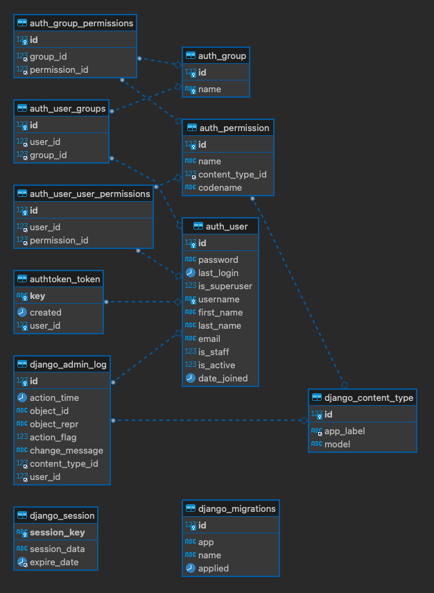

# Django auth and admin

## About
[Django](https://www.djangoproject.com/) is a high-level Python web framework.

## ER Diagram

## Database Schema

| table                      | Field           | Type                 | Collation          | Null | Key            | Default | Extra |
|----------------------------|-----------------|----------------------|--------------------|------|----------------|---------|-------|
| auth_group                 | id              | int(11)              || NO                 | PRI  || auto_increment |
| auth_group                 | name            | varchar(150)         | utf8mb4_unicode_ci | NO   | UNI            |||
| auth_group_permissions     | id              | bigint(20)           || NO                 | PRI  || auto_increment |
| auth_group_permissions     | group_id        | int(11)              || NO                 | MUL  |||
| auth_group_permissions     | permission_id   | int(11)              || NO                 | MUL  |||
| auth_permission            | id              | int(11)              || NO                 | PRI  || auto_increment |
| auth_permission            | name            | varchar(255)         | utf8mb4_unicode_ci | NO   ||||
| auth_permission            | content_type_id | int(11)              || NO                 | MUL  |||
| auth_permission            | codename        | varchar(100)         | utf8mb4_unicode_ci | NO   ||||
| auth_user                  | id              | int(11)              || NO                 | PRI  || auto_increment |
| auth_user                  | password        | varchar(128)         | utf8mb4_unicode_ci | NO   ||||
| auth_user                  | last_login      | datetime(6)          || YES                ||||
| auth_user                  | is_superuser    | tinyint(1)           || NO                 ||||
| auth_user                  | username        | varchar(150)         | utf8mb4_unicode_ci | NO   | UNI            |||
| auth_user                  | first_name      | varchar(150)         | utf8mb4_unicode_ci | NO   ||||
| auth_user                  | last_name       | varchar(150)         | utf8mb4_unicode_ci | NO   ||||
| auth_user                  | email           | varchar(254)         | utf8mb4_unicode_ci | NO   ||||
| auth_user                  | is_staff        | tinyint(1)           || NO                 ||||
| auth_user                  | is_active       | tinyint(1)           || NO                 ||||
| auth_user                  | date_joined     | datetime(6)          || NO                 ||||
| auth_user_groups           | id              | bigint(20)           || NO                 | PRI  || auto_increment |
| auth_user_groups           | user_id         | int(11)              || NO                 | MUL  |||
| auth_user_groups           | group_id        | int(11)              || NO                 | MUL  |||
| auth_user_user_permissions | id              | bigint(20)           || NO                 | PRI  || auto_increment |
| auth_user_user_permissions | user_id         | int(11)              || NO                 | MUL  |||
| auth_user_user_permissions | permission_id   | int(11)              || NO                 | MUL  |||
| authtoken_token            | key             | varchar(40)          | utf8mb4_unicode_ci | NO   | PRI            |||
| authtoken_token            | created         | datetime(6)          || NO                 ||||
| authtoken_token            | user_id         | int(11)              || NO                 | UNI  |||
| django_admin_log           | id              | int(11)              || NO                 | PRI  || auto_increment |
| django_admin_log           | action_time     | datetime(6)          || NO                 ||||
| django_admin_log           | object_id       | longtext             | utf8mb4_unicode_ci | YES  ||||
| django_admin_log           | object_repr     | varchar(200)         | utf8mb4_unicode_ci | NO   ||||
| django_admin_log           | action_flag     | smallint(5) unsigned || NO                 ||||
| django_admin_log           | change_message  | longtext             | utf8mb4_unicode_ci | NO   ||||
| django_admin_log           | content_type_id | int(11)              || YES                | MUL  |||
| django_admin_log           | user_id         | int(11)              || NO                 | MUL  |||
| django_content_type        | id              | int(11)              || NO                 | PRI  || auto_increment |
| django_content_type        | app_label       | varchar(100)         | utf8mb4_unicode_ci | NO   | MUL            |||
| django_content_type        | model           | varchar(100)         | utf8mb4_unicode_ci | NO   ||||
| django_migrations          | id              | bigint(20)           || NO                 | PRI  || auto_increment |
| django_migrations          | app             | varchar(255)         | utf8mb4_unicode_ci | NO   ||||
| django_migrations          | name            | varchar(255)         | utf8mb4_unicode_ci | NO   ||||
| django_migrations          | applied         | datetime(6)          || NO                 ||||
| django_session             | session_key     | varchar(40)          | utf8mb4_unicode_ci | NO   | PRI            |||
| django_session             | session_data    | longtext             | utf8mb4_unicode_ci | NO   ||||
| django_session             | expire_date     | datetime(6)          || NO                 | MUL  |||