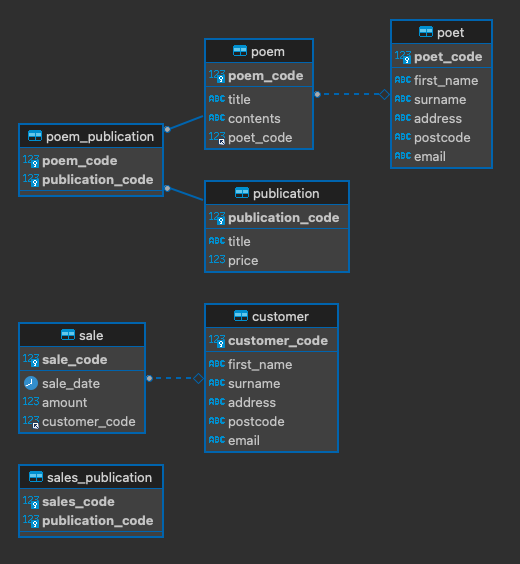

# MariaDB - Database Design Example

## Example 
[Database Design Example](https://mariadb.com/kb/en/database-design-example-phase-3-implementation/)

License: [CC BY-SA](https://creativecommons.org/licenses/by-sa/3.0/) / [Gnu FDL](http://www.gnu.org/licenses/fdl-1.3.html)

```sql
CREATE DATABASE poets_circle;

CREATE TABLE poet (
  poet_code INT NOT NULL, 
  first_name VARCHAR(30),
  surname VARCHAR(40), 
  address VARCHAR(100), 
  postcode VARCHAR(20),
  email VARCHAR(254), 
  PRIMARY KEY(poet_code)
);

CREATE TABLE poem(
  poem_code INT NOT NULL, 
  title VARCHAR(50),
  contents TEXT, 
  poet_code INT NOT NULL, 
  PRIMARY KEY(poem_code),
  INDEX(poet_code), 
  FOREIGN KEY(poet_code) REFERENCES poet(poet_code) 
);

CREATE TABLE publication(
  publication_code INT NOT NULL,
  title VARCHAR(100),
  price MEDIUMINT UNSIGNED,
  PRIMARY KEY(publication_code)
);

CREATE TABLE poem_publication(
  poem_code INT NOT NULL,
  publication_code INT NOT NULL, 
  PRIMARY KEY(poem_code, publication_code), 
  INDEX(publication_code),
  FOREIGN KEY(poem_code) REFERENCES poem(poem_code),
  FOREIGN KEY(publication_code) REFERENCES publication(publication_code)
);

CREATE TABLE sales_publication(
  sales_code INT NOT NULL,
  publication_code INT NOT NULL,
  PRIMARY KEY(sales_code, publication_code)
); 

CREATE TABLE customer(
  customer_code INT NOT NULL, 
  first_name VARCHAR(30), 
  surname VARCHAR(40), 
  address VARCHAR(100), 
  postcode VARCHAR(20), 
  email VARCHAR(254), 
  PRIMARY KEY(customer_code)
);

CREATE TABLE sale(
  sale_code INT NOT NULL, 
  sale_date DATE,
  amount INT UNSIGNED, 
  customer_code INT NOT NULL, 
  PRIMARY KEY(sale_code), 
  INDEX(customer_code), 
  FOREIGN KEY(customer_code) REFERENCES customer(customer_code)
);
```

## ER Diagram

