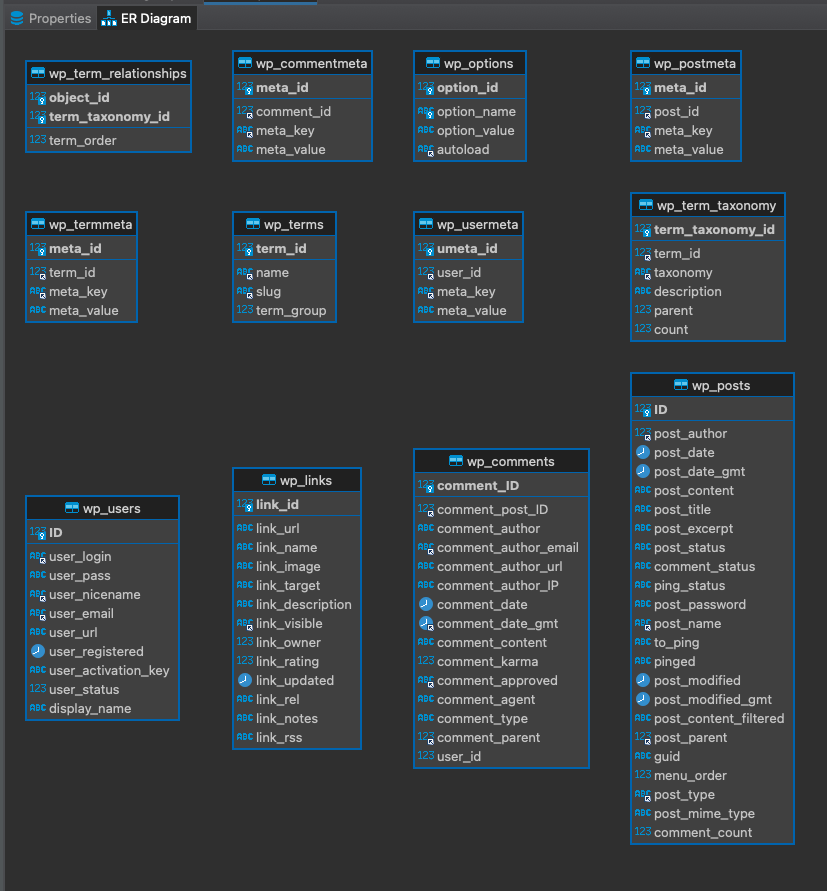

# Wordpress

## About 
[Wordpress](https://wordpress.org/) is open source software to create a beautiful website, blog, or app.

## ER Diagram

## Database Schema
[wordpress.xlsx](wordpress.xlsx)

| table                 | Field                 | Type                | Collation          | Null                | Key                 | Default | Extra |
|-----------------------|-----------------------|---------------------|--------------------|---------------------|---------------------|---------|-------|
| wp_commentmeta        | meta_id               | bigint(20) unsigned || NO                 | PRI                 || auto_increment      |
| wp_commentmeta        | comment_id            | bigint(20) unsigned || NO                 | MUL                 | 0                   ||
| wp_commentmeta        | meta_key              | varchar(255)        | utf8mb4_unicode_ci | YES                 | MUL                 |||
| wp_commentmeta        | meta_value            | longtext            | utf8mb4_unicode_ci | YES                 ||||
| wp_comments           | comment_ID            | bigint(20) unsigned || NO                 | PRI                 || auto_increment      |
| wp_comments           | comment_post_ID       | bigint(20) unsigned || NO                 | MUL                 | 0                   ||
| wp_comments           | comment_author        | tinytext            | utf8mb4_unicode_ci | NO                  ||||
| wp_comments           | comment_author_email  | varchar(100)        | utf8mb4_unicode_ci | NO                  | MUL                 |||
| wp_comments           | comment_author_url    | varchar(200)        | utf8mb4_unicode_ci | NO                  ||||
| wp_comments           | comment_author_IP     | varchar(100)        | utf8mb4_unicode_ci | NO                  ||||
| wp_comments           | comment_date          | datetime            || NO                 || 0000-00-00 00:00:00 ||
| wp_comments           | comment_date_gmt      | datetime            || NO                 | MUL                 | 0000-00-00 00:00:00 ||
| wp_comments           | comment_content       | text                | utf8mb4_unicode_ci | NO                  ||||
| wp_comments           | comment_karma         | int(11)             || NO                 || 0                   ||
| wp_comments           | comment_approved      | varchar(20)         | utf8mb4_unicode_ci | NO                  | MUL                 | 1       ||
| wp_comments           | comment_agent         | varchar(255)        | utf8mb4_unicode_ci | NO                  ||||
| wp_comments           | comment_type          | varchar(20)         | utf8mb4_unicode_ci | NO                  || comment             ||
| wp_comments           | comment_parent        | bigint(20) unsigned || NO                 | MUL                 | 0                   ||
| wp_comments           | user_id               | bigint(20) unsigned || NO                 || 0                   ||
| wp_links              | link_id               | bigint(20) unsigned || NO                 | PRI                 || auto_increment      |
| wp_links              | link_url              | varchar(255)        | utf8mb4_unicode_ci | NO                  ||||
| wp_links              | link_name             | varchar(255)        | utf8mb4_unicode_ci | NO                  ||||
| wp_links              | link_image            | varchar(255)        | utf8mb4_unicode_ci | NO                  ||||
| wp_links              | link_target           | varchar(25)         | utf8mb4_unicode_ci | NO                  ||||
| wp_links              | link_description      | varchar(255)        | utf8mb4_unicode_ci | NO                  ||||
| wp_links              | link_visible          | varchar(20)         | utf8mb4_unicode_ci | NO                  | MUL                 | Y       ||
| wp_links              | link_owner            | bigint(20) unsigned || NO                 || 1                   ||
| wp_links              | link_rating           | int(11)             || NO                 || 0                   ||
| wp_links              | link_updated          | datetime            || NO                 || 0000-00-00 00:00:00 ||
| wp_links              | link_rel              | varchar(255)        | utf8mb4_unicode_ci | NO                  ||||
| wp_links              | link_notes            | mediumtext          | utf8mb4_unicode_ci | NO                  ||||
| wp_links              | link_rss              | varchar(255)        | utf8mb4_unicode_ci | NO                  ||||
| wp_options            | option_id             | bigint(20) unsigned || NO                 | PRI                 || auto_increment      |
| wp_options            | option_name           | varchar(191)        | utf8mb4_unicode_ci | NO                  | UNI                 |||
| wp_options            | option_value          | longtext            | utf8mb4_unicode_ci | NO                  ||||
| wp_options            | autoload              | varchar(20)         | utf8mb4_unicode_ci | NO                  | MUL                 | yes     ||
| wp_postmeta           | meta_id               | bigint(20) unsigned || NO                 | PRI                 || auto_increment      |
| wp_postmeta           | post_id               | bigint(20) unsigned || NO                 | MUL                 | 0                   ||
| wp_postmeta           | meta_key              | varchar(255)        | utf8mb4_unicode_ci | YES                 | MUL                 |||
| wp_postmeta           | meta_value            | longtext            | utf8mb4_unicode_ci | YES                 ||||
| wp_posts              | ID                    | bigint(20) unsigned || NO                 | PRI                 || auto_increment      |
| wp_posts              | post_author           | bigint(20) unsigned || NO                 | MUL                 | 0                   ||
| wp_posts              | post_date             | datetime            || NO                 || 0000-00-00 00:00:00 ||
| wp_posts              | post_date_gmt         | datetime            || NO                 || 0000-00-00 00:00:00 ||
| wp_posts              | post_content          | longtext            | utf8mb4_unicode_ci | NO                  ||||
| wp_posts              | post_title            | text                | utf8mb4_unicode_ci | NO                  ||||
| wp_posts              | post_excerpt          | text                | utf8mb4_unicode_ci | NO                  ||||
| wp_posts              | post_status           | varchar(20)         | utf8mb4_unicode_ci | NO                  || publish             ||
| wp_posts              | comment_status        | varchar(20)         | utf8mb4_unicode_ci | NO                  || open                ||
| wp_posts              | ping_status           | varchar(20)         | utf8mb4_unicode_ci | NO                  || open                ||
| wp_posts              | post_password         | varchar(255)        | utf8mb4_unicode_ci | NO                  ||||
| wp_posts              | post_name             | varchar(200)        | utf8mb4_unicode_ci | NO                  | MUL                 |||
| wp_posts              | to_ping               | text                | utf8mb4_unicode_ci | NO                  ||||
| wp_posts              | pinged                | text                | utf8mb4_unicode_ci | NO                  ||||
| wp_posts              | post_modified         | datetime            || NO                 || 0000-00-00 00:00:00 ||
| wp_posts              | post_modified_gmt     | datetime            || NO                 || 0000-00-00 00:00:00 ||
| wp_posts              | post_content_filtered | longtext            | utf8mb4_unicode_ci | NO                  ||||
| wp_posts              | post_parent           | bigint(20) unsigned || NO                 | MUL                 | 0                   ||
| wp_posts              | guid                  | varchar(255)        | utf8mb4_unicode_ci | NO                  ||||
| wp_posts              | menu_order            | int(11)             || NO                 || 0                   ||
| wp_posts              | post_type             | varchar(20)         | utf8mb4_unicode_ci | NO                  | MUL                 | post    ||
| wp_posts              | post_mime_type        | varchar(100)        | utf8mb4_unicode_ci | NO                  ||||
| wp_posts              | comment_count         | bigint(20)          || NO                 || 0                   ||
| wp_term_relationships | object_id             | bigint(20) unsigned || NO                 | PRI                 | 0                   ||
| wp_term_relationships | term_taxonomy_id      | bigint(20) unsigned || NO                 | PRI                 | 0                   ||
| wp_term_relationships | term_order            | int(11)             || NO                 || 0                   ||
| wp_term_taxonomy      | term_taxonomy_id      | bigint(20) unsigned || NO                 | PRI                 || auto_increment      |
| wp_term_taxonomy      | term_id               | bigint(20) unsigned || NO                 | MUL                 | 0                   ||
| wp_term_taxonomy      | taxonomy              | varchar(32)         | utf8mb4_unicode_ci | NO                  | MUL                 |||
| wp_term_taxonomy      | description           | longtext            | utf8mb4_unicode_ci | NO                  ||||
| wp_term_taxonomy      | parent                | bigint(20) unsigned || NO                 || 0                   ||
| wp_term_taxonomy      | count                 | bigint(20)          || NO                 || 0                   ||
| wp_termmeta           | meta_id               | bigint(20) unsigned || NO                 | PRI                 || auto_increment      |
| wp_termmeta           | term_id               | bigint(20) unsigned || NO                 | MUL                 | 0                   ||
| wp_termmeta           | meta_key              | varchar(255)        | utf8mb4_unicode_ci | YES                 | MUL                 |||
| wp_termmeta           | meta_value            | longtext            | utf8mb4_unicode_ci | YES                 ||||
| wp_terms              | term_id               | bigint(20) unsigned || NO                 | PRI                 || auto_increment      |
| wp_terms              | name                  | varchar(200)        | utf8mb4_unicode_ci | NO                  | MUL                 |||
| wp_terms              | slug                  | varchar(200)        | utf8mb4_unicode_ci | NO                  | MUL                 |||
| wp_terms              | term_group            | bigint(10)          || NO                 || 0                   ||
| wp_usermeta           | umeta_id              | bigint(20) unsigned || NO                 | PRI                 || auto_increment      |
| wp_usermeta           | user_id               | bigint(20) unsigned || NO                 | MUL                 | 0                   ||
| wp_usermeta           | meta_key              | varchar(255)        | utf8mb4_unicode_ci | YES                 | MUL                 |||
| wp_usermeta           | meta_value            | longtext            | utf8mb4_unicode_ci | YES                 ||||
| wp_users              | ID                    | bigint(20) unsigned || NO                 | PRI                 || auto_increment      |
| wp_users              | user_login            | varchar(60)         | utf8mb4_unicode_ci | NO                  | MUL                 |||
| wp_users              | user_pass             | varchar(255)        | utf8mb4_unicode_ci | NO                  ||||
| wp_users              | user_nicename         | varchar(50)         | utf8mb4_unicode_ci | NO                  | MUL                 |||
| wp_users              | user_email            | varchar(100)        | utf8mb4_unicode_ci | NO                  | MUL                 |||
| wp_users              | user_url              | varchar(100)        | utf8mb4_unicode_ci | NO                  ||||
| wp_users              | user_registered       | datetime            || NO                 || 0000-00-00 00:00:00 ||
| wp_users              | user_activation_key   | varchar(255)        | utf8mb4_unicode_ci | NO                  ||||
| wp_users              | user_status           | int(11)             || NO                 || 0                   ||
| wp_users              | display_name          | varchar(250)        | utf8mb4_unicode_ci | NO                  ||||